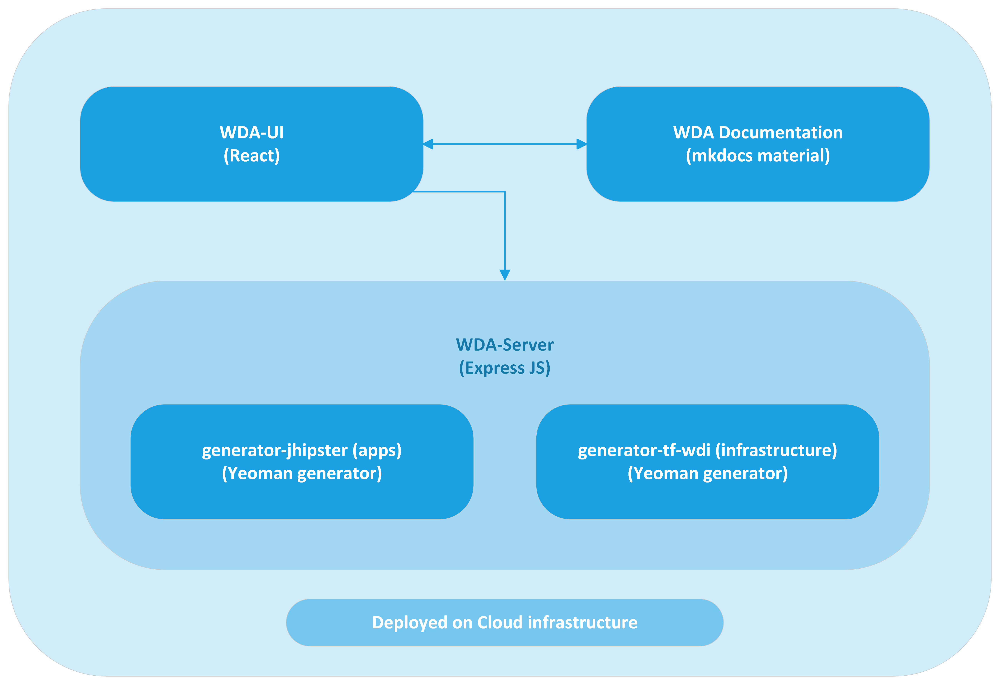

# Architecture

## Well Defined Architecture

WDA mainly comprises of two components, generator-jhipster and generator-tf-wdi.

JHipster is a full-stack platform for developing modern web applications and microservices using Spring Boot and Angular or React. It provides a set of tools and features that help developers create applications quickly and efficiently.

It is forked and extended for the capabilities envisioned for WDA.

generator-tf-wdi is a component built to generate terraform automation for hosting the applications generated by generator-jhipster.
Both components are developed using yeoman, a scaffolding framework. All the boilerplate code can be templatized and scaffolded with ease.

References:

- [JHipster](https://www.jhipster.tech/)
- [Yeoman](https://yeoman.io/)

