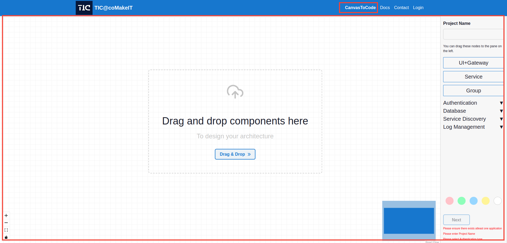

Welcome to the CanvasToCode! It's a powerful tool for planning your project architecture by visualizing the components of your application using draggable nodes and connecting edges. Follow these steps to effectively use the CanvasToCode:

### Step 1: Accessing CanvasToCode
To get started, visit our website by [Clicking here](http://wda-ui.s3-website.ap-south-1.amazonaws.com/). You can access the CanvasToCode from the navigation bar and also from CanvasToCode button on home page.

### Step 2: Logging in
To save your projects for future refference, you need to log in. Click on the "Login" option.

If you don't have an account, you can create one by clicking on "Register" on the login page and then log in.

### Step 3: Get Started with CanvasToCode
After navigating to CanvasToCode the canvas will open for you to start working on.

### Step 4: Adding the UI+Gateway Node
The UI+Gateway node represents the frontend and gateway of your project. To add this node simply drag the node from sidebar and there can be only one node of this type, double click on it to open a modal and provide the necessary information.

### Step 5: Adding Service Nodes
Service nodes represent the microservices in your project. You can add multiple service nodes by drag and drop from sidebar, double-click on them to open modals and provide the required information.

### Step 6: Adding Other Components
In the sidebar, you'll find draggable nodes for various components such as the Auth Provider (Keycloak), Database (Postgres and MongoDB), Service Discovery (Eureka), and Log Management (ECK). Drag these nodes onto your CanvasToCode canvas to visualize the components in your project. Once added to the project these are applied for every node present on canvas.

### Step 7: Grouping
In the side bar you can see node called a group, this is a re-sizable node which can be used to group your components for a clear picture.

### Naming Group
And you can also provide a name to the group, by double-click on the group node.

### Step 8: Creating Connections
Nodes in the can be connected using edges. There are two types of connections you can create:
###  Database Connection 
Connect a Service or UI+Gateway node with a database node to associate the service with its corresponding database.

### Interservice Communication 
Connect two service nodes to establish communication between them. Double click on an edge to define the type of communication.

### Step 9: Adding Colors
You can differenciate nodes by adding different colors, to add a color just select the node and apick a color from the side bar.

### Step 10: Saving your Project
If you have login to the canvas, at the bottom of the sidebar there's a checkbox to save project. Check this box if you want to save your project details for future reference.

### Accesing Saved Projects
You can view your previous projects from the Projects tab. Don't forget to enter a project name in the input box at the top of the sidebar.

### Step 11: Moving to the Next Step
Once you've filled in all the necessary information and provided a project name, click on the "Next" button. A popup will appear, giving you the option to select a deployment infrastructure for your project. 

select your option, fill in the details and click "Submit." If you don't need a deployment infrastructure, simply click on the "Skip" button.

### Step 12: Project Generation
Sit back and relax! We will generate a zip file for your project based on the information you provided.

To know more and for detailed information of the options available you can refer [Documentation](/docs/Documentation/MindMap/Introduction/)
We hope you find the CanvasToCode intuitive and helpful for planning and visualizing your project architecture. If you have any further questions or need assistance, please don't hesitate to reach out. 