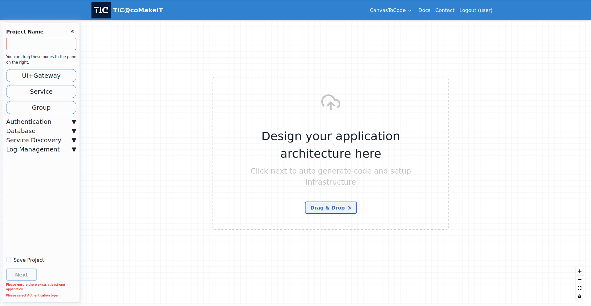

The Mind Map Designer is an innovative tool designed to simplify the process of visualizing and planning your project architecture. With its intuitive interface, you can easily drag and drop nodes representing different components onto your Mind Map, creating a comprehensive overview of your project structure.

Whether you're defining the frontend UI, configuring microservices, or integrating essential components like authentication providers, databases, service discovery, and log management, the Mind Map Designer has got you covered. Simply double-click on each node to input specific information and customize it according to your project requirements.

Effortlessly establish communication between your services by adding edges, and define the communication type with a simple double-click. The Mind Map Designer empowers you to create clear and meaningful representations of how your project components interact and collaborate.

To ensure seamless collaboration and future reference, the tool provides options for saving project metadata. By enabling the checkbox, you can conveniently store and access project details for later use. Additionally, the Projects tab allows you to view and manage your previous projects effortlessly.

Once you've inputted all the necessary information and provided a project name, you can progress to the next step. A popup will appear, presenting you with the opportunity to select a deployment infrastructure for your project. Fill in the required details and submit your preferences. If you don't require a deployment infrastructure, you can easily skip this step.

Finally, sit back and let the Mind Map Designer work its magic! It will generate a comprehensive zip file containing your project, encompassing all the configured components and communication details you've defined. Enjoy the streamlined and efficient project generation process facilitated by the Mind Map Designer.

Experience the power of visualization and organization with the Mind Map Designer, making your project planning a breeze. Start using it today and witness the benefits of this user-friendly and feature-rich tool.